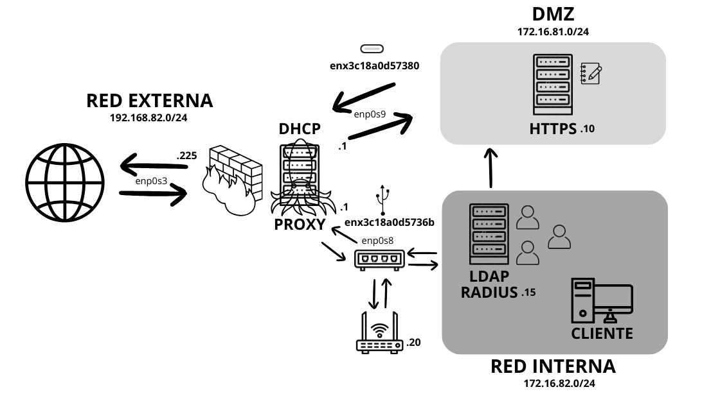

# Trabajo Final SGD

## Introducción

En nuestro futuro escenario, estaremos configurando un firewall en un servidor Ubuntu equipado con tres interfaces de red: `enp0s3` para NAT, que nos permitirá la conexión con Internet; `enp0s8`, destinada a nuestra red interna, donde planeamos albergar un punto de acceso (AP), un servidor LDAP y un cliente; y `enp0s9`, que expandiremos hacia una DMZ para situar un servidor web. Nuestro plan incluye la implementación de un proxy Squid que se encargará exclusivamente de filtrar el tráfico destinado a la red interna, con el objetivo de optimizar la seguridad y la gestión del tráfico mediante iptables, y al mismo tiempo mejorar la eficiencia de la navegación web, garantizando así un acceso controlado y seguro para nuestra infraestructura interna y los servicios expuestos en la DMZ.



## Preparando el servidor principal

Deberemos configurar la IP estática para cada una de las interfaces del servidor, y configuraremos el servicio DHCP para que le proporcione a los clientes de la red interna una IP de forma automática.

### Configuración del netplan

- Paso 1

  Modificamos el archivo /etc/netplan/00-installer-config.yaml y añadimos las siguientes lineas:
   ```bash
    $ sudo nano /etc/netplan/00-installer-config.yaml
         network:
           version: 2
           renderer: networkd
           ethernets:
             enp0s3:
               dhcp4: false
               addresses:
                - 192.168.82.225/24
               routes:
                - to: default
                  via: 192.168.82.100
               nameservers:
                 addresses: [8.8.8.8]
             enp0s8:
               dhcp4: false
               addresses:
                - 172.16.82.1/24
             enp0s9:
               dhcp4: false
               addresses:
                - 172.16.81.1/24
  ```

- Paso 2

  Aplicamos los cambios:
  ```bash
   $ sudo netplan apply
  ```

### Configurando el servicio DHCP

- Paso 1

  Primero que nada actualizaremos los paquetes con las versiones más recientes:
  ```bash
   $ sudo apt-get update && sudo apt-get full-upgrade
  ```

- Paso 2

  Ahora instalamos el servicio isc-dhcp-server:
  ```bash
   $ sudo apt-get install isc-dhcp-server
  ```

- Paso 3

  Modificaremos el archivo /etc/default/isc-dhcp-server, y especificaremos la interfaz por la que atenderá a los clientes:
  ```bash
   $ sudo nano /etc/default/isc-dhcp-server
        ...
        INTERFACESv4="enp0s8"
        ...
  ```

- Paso 4

  Editamos el archivo /etc/dhcp/dhcpd.conf y configuraremos lo que el servidor ofrecerá a los clientes:
  ```bash
   $ sudo nano /etc/dhcp/dhcpd.conf
        ...
        subnet 172.16.82.0 netmask 255.255.255.0 {
         range 172.16.82.50 172.16.82.90;
         option routers 172.16.82.1;
         option domain-name-servers 8.8.8.8;
         default-lease-time 600;
         max-lease-time 7200;
        }
        ...
  ```

- Paso 5
 
    Vamos a reiniciar el servicio y consultar que su estado es active:
    ```bash
     $ sudo systemctl restart isc-dhcp-server
     $ sudo systemctl status isc-dhcp-server
    ```


## Firewall

Para poder facilitarnos el proceso de aplicar las reglas de iptables, instalaremos el siguiente paquete:
 ```bash
     $ sudo apt-get install iptables-persistent
 ```

### FW00 - El Firewall realiza NAT correctamente

- Paso 1

  Primero activamos el enrutamiento modificando el archivo /etc/sysctl.conf y descomentando la siguiente línea:
   ```bash
     $ sudo nano /etc/sysctl.conf
          ...
          net.ipv4.ip_forward=1
          ...
   ```

- Paso 2

  Guardamos los cambios para que se inicie cada vez que el servidor se encienda:
  ```bash
     $ sudo sysctl -p 
  ```

- Paso 3

  Agregamos la siguiente regla de iptables para que realice NAT:
   ```bash
     $ sudo iptables -t nat -A POSTROUTING -o enp0s3 -j MASQUERADE
   ```

- Paso 4

  Para que se aplique la regla deberemos escribir los siguientes comandos:
  ```bash
     $ sudo netfilter-persistent save
     $ sudo netfilter-persistent reload
  ```

### FW01 - El acceso a la red interna está controlado por el firewall

- Paso 1

  Vamos crear una regla que rechace todo el tráfico forward:
   ```bash
     $ sudo iptables –P FORWARD DROP
   ```

- Paso 2

  Vamos a aceptar el tráfico que salga de la DMZ para que pueda salir hacia afuera:
   ```bash
     $ sudo iptables -A FORWARD -i enp0s9 -o enp0s3 -j ACCEPT
   ```

- Paso 3

  De lo que venga de fuera, solo podrá acceder a la DMZ y a la red interna los paquetes con estado ESTABLISHED o RELATED:
   ```bash
     $ sudo iptables –A FORWARD –i enp0s3 –o enp0s9 –m state –state ESTABLISHED.RELATED -j ACCEPT
     $ sudo iptables –A FORWARD –i enp0s3 –o enp0s8 –m state –state ESTABLISHED.RELATED -j ACCEPT
   ```

- Paso 4

  Para que se apliquen las reglas deberemos escribir los siguientes comandos:
  ```bash
     $ sudo netfilter-persistent save
     $ sudo netfilter-persistent reload
  ```

### FW02 - Se permite la navegación desde la red interna 

- Paso 1

  Aceptamos el tráfico que salga de la red interna para que pueda salir hacia afuera con la siguiente regla:
  ```bash
     $ sudo iptables -A FORWARD -i enp0s8 -o enp0s3 -j ACCEPT
   ```

- Paso 2

  Para que se aplique la regla deberemos escribir los siguientes comandos:
  ```bash
     $ sudo netfilter-persistent save
     $ sudo netfilter-persistent reload
  ```

### FW03 - Se permite el acceso al servidor web desde exterior

- Paso 1

  Aceptamos los paquetes que vengan de fuera por los puertos 80 y 443:
   ```bash
     $ sudo iptables -A FORWARD -i enp0s3 -o enp0s9 –p tcp –m multiport –dports 80,443 -j ACCEPT
   ```

- Paso 2

  Redirigimos todo el tráfico TCP que llega al equipo en los puertos 80 y 443 de la interfaz enp0s3 hacia la dirección IP 172.16.81.10.
  ```bash
     $ sudo iptables -t nat -A PREROUTING -i enp0s3 -p tcp -m multiport --dports 80,443 -j DNAT --to-destination 172.16.81.10 
   ```

- Paso 3

  Para que se apliquen las reglas deberemos escribir los siguientes comandos:
  ```bash
     $ sudo netfilter-persistent save
     $ sudo netfilter-persistent reload
  ```

### FW04 - El acceso a la red interna no está permitido desde la DMZ 

- Paso 1

  Aceptamos el tráfico que salga de la red interna hacia la DMZ con la siguiente regla:
   ```bash
     $ sudo iptables -A FORWARD -i enp0s8 -o enp0s9 -j ACCEPT 
   ```

- Paso 2

  De lo que venga de la DMZ, solo podrá acceder a la red interna los paquetes con estado ESTABLISHED o RELATED:
   ```bash
     $ sudo iptables –A FORWARD –i enp0s9 –o enp0s8 –m state –state ESTABLISHED.RELATED -j ACCEPT
   ```

- Paso 3

  Rechazamos el resto de paquetes que puedan venir desde la DMZ:
   ```bash
     $ sudo iptables -A FORWARD -i enp0s9 -o enp0s8 -j DROP 
   ```

- Paso 4

  Para que se apliquen las reglas deberemos escribir los siguientes comandos:
  ```bash
     $ sudo netfilter-persistent save
     $ sudo netfilter-persistent reload
  ```


## Proxy

Estaremos utilizando en esta ocasión, el proxy Squid, es un servidor web proxy-caché con licencia GPL cuyo objetivo es funcionar como proxy de la red y también como zona caché para almacenar páginas web, entre otros.
 ```bash
     $ sudo apt-get install squid
 ```

### PROXY01 - Está configurado de forma transparente

- Paso 1

   Modificaremos el fichero /etc/squid/squid.conf, y escribiremos lo siguiente:
   ```bash
     $ sudo nano /etc/squid/squid.conf
          ...
          http_port 3128 transparent
          ...
   ```

- Paso 2

  Estableceremos la siguiente regla para redirigir el tráfico entrante del puerto 80 y 443 hacia el puerto 3128 que es el puerto escucha del proxy:
  ```bash
     $ sudo iptables -t nat -A PREROUTING -p tcp -m multiport --dports 80,443 -j REDIRECT --to-port 3128 
  ```

- Paso 3

  Para que se aplique la regla deberemos escribir los siguientes comandos:
  ```bash
     $ sudo netfilter-persistent save
     $ sudo netfilter-persistent reload
  ```

***ATENCIÓN: El proxy transparente no funciona de forma simultanea con el siguiente paso, solo podemos configurar uno a la vez en cada proxy, por lo que debemos elegir cual preferimos para nuestra configuración. En nustro caso, nos quedaremos con el siguiente paso y añadiremos de forma manual la IP de nuestro proxy en la configuración de nuestro navegador cliente.***

### PROXY02 - La navegación a través del proxy se hace previa autenticación con los usuarios de LDAP.

- Paso 1

  Modificaremos el fichero /etc/squid/squid.conf, y escribiremos lo siguiente:
   ```bash
     $ sudo nano /etc/squid/squid.conf
          ...
          auth_param basic program /usr/lib/squid/basic_ldap_auth -b "ou=People,dc=aba,dc=com" -f "uid=%s -h 172.16.82.15"
          auth_param basic children 5 startup=5 idle=1

          auth_param basic credentialsttl 2 hours
          acl ldap_users proxy_auth REQUIRED

          http_access allow ldap_users
          http_access allow all
          ...
   ```

- Paso 2

  Reiniciaremos el servicio squid para aplicar los cambios:
   ```bash
     $ sudo systemctl restart squid
   ```

### PROXY03 - Impide la navegación a webs específicas 

- Paso 1

  Modificaremos el fichero /etc/squid/squid.conf, y escribiremos lo siguiente:
   ```bash
     $ sudo nano /etc/squid/squid.conf
          ...
          acl sitios dstdomain .(sitio web especifico)

          http_access deny sitios
          http_access
          ...
   ```

- Paso 2

  Reiniciaremos el servicio squid para aplicar los cambios:
   ```bash
     $ sudo systemctl restart squid
   ```

## Preparando el servidor web de la DMZ

Deberemos configurar la IP estática para el servidor web, e instalaremos el servicio apache.

### Configuración del netplan

- Paso 1

  Modificamos el archivo /etc/netplan/00-installer-config.yaml y añadimos las siguientes lineas:
   ```bash
    $ sudo nano /etc/netplan/00-installer-config.yaml
         network:
           version: 2
           renderer: networkd
           ethernets:
             enp0s3:
               dhcp4: false
               addresses:
                - 172.16.81.10/24
               routes:
                - to: default
                  via: 172.16.81.1
               nameservers:
                 addresses: [8.8.8.8]
  ```

- Paso 2

  Aplicamos los cambios:
  ```bash
   $ sudo netplan apply
  ```

### Instalamos Apache

- Paso 1
 
  Instalamos el paquete apache:
  ```bash
   $ sudo apt-get install apache2
  ```

## Servidor Web

### WEB01 - Es accesible desde la red externa 

### WEB02 - Sirve la página index.html

### WEB03 - Sirve la documentación elaborada con un procesador de textos en formato PDF 

### WEB04-EX - Sirve la documentación elaborada en formato MarkDown como HTML 

### WEB05-EX - Se lleva a cabo una conexión segura mediante el protocolo HTTPS mediante un certificado firmado por una autoridad NO reconocida.

#### Crear CA

- Paso 1

  Instalamos el conjunto de secuencias de comandos easy-rsa:
  ```bash
    $ sudo apt install easy-rsa
  ```
  
- Paso 2

  Preparamos un directorio para la infraestructura de clave pública:
  ```bash
    $ sudo mkdir ~/easy-rsa
    ```
  
- Paso 3

  Creamos enlaces simbólicos que apunten a los archivos del paquete easy-rsa:
  ```bash
    $ sudo ln -s /usr/share/easy-rsa/* ~/easy-rsa/
    ```

- Paso 4

  Restringimos el acceso para que solo el propietario pueda acceder a él:
  ```bash
    $ sudo chmod 700 /home/dmz/easy-rsa
    ```
- Paso 5

  Inciamos el PKI dentro del directory easy-rsa:
   ```bash
    $ cd ~/easy-rsa
    $ ./easyrsa init-pki
    ```

- Paso 6

  Creamos y editamos el fichero vars con los datos de la organización:
  ```bash
    $ sudo nano ~/easy-rsa/vars
      ~/easy-rsa/vars
      set_var EASYRSA_REQ_COUNTRY    "España"
      set_var EASYRSA_REQ_PROVINCE   "Valencia"
      set_var EASYRSA_REQ_CITY       "Valencia"
      set_var EASYRSA_REQ_ORG        "ABA"
      set_var EASYRSA_REQ_EMAIL      "aba@sgd.com"
      set_var EASYRSA_REQ_OU         "Community"
      set_var EASYRSA_ALGO           "ec"
      set_var EASYRSA_DIGEST         "sha512"

    ```

#### Generar certificado

- Paso 1

  Creamos el certificado root público y el par de claves privadas para su entidad de certificación:
  ```bash
    $ ./easyrsa build-ca
    ```

- Paso 2
 
  Copiamos todo el contenido del archivo ~/easy-rsa/pki/ca.crt:
     ```bash
    $ cat ~/easy-rsa/pki/ca.crt
     -----BEGIN CERTIFICATE-----
      MIIDSDCCAjCgAwIBAgIUC8eXCt5zFkhK8iVa5hb8IUsrPLowDQYJKoZIhvcNAQEL
      BQAwFTETMBEGA1UEAwwKQ0EtYmFyYmFyYTAeFw0yMzExMDIxMjAyMTlaFw0zMzEw
      MzAxMjAyMTlaMBUxEzARBgNVBAMMCkNBLWJhcmJhcmEwggEiMA0GCSqGSIb3DQEB
      AQUAA4IBDwAwggEKAoIBAQCz8agL3slcVVGPYWCiNvYEGPzbB+s1RbQmy8Ri5lSn
      cSWXXRfyiHFZD3h6gS+5IKvqFrfyxf/pkCdFJbNTK+PZa4vQZ2D+LUnA6e61oal4
      H17JZbRhV0hcHZVuhTkUpah51WS/4QCBl5m5WeWkrmaDx7I58HNT+VJi57hv82rv
      mUo29aVP0bnN8UOQvObC1K1UvzM3uY9pnawcbRcgJC5+djSKL6E3dBed3W6gnVah
      JXmBQJjVsyQqLFVkIErd5WrKHx4LyEyyWvsSWp7adS5t5/agDPMQrbhxeKgwVpwl
      CJyWIEj8VNZfbYVwWTfiVQ0FZ1ImV8tkvUXinvMTSEBtAgMBAAGjgY8wgYwwHQYD
      VR0OBBYEFHwXGwmoPmhPVbEkn6Y3k8QVRVAXMFAGA1UdIwRJMEeAFHwXGwmoPmhP
      VbEkn6Y3k8QVRVAXoRmkFzAVMRMwEQYDVQQDDApDQS1iYXJiYXJhghQLx5cK3nMW
      SEryJVrmFvwhSys8ujAMBgNVHRMEBTADAQH/MAsGA1UdDwQEAwIBBjANBgkqhkiG
      9w0BAQsFAAOCAQEAVFbBl63AdzFUfsGZYEwyA01qSW/iWqq493c+EGXMbHl4vj5k
      eeFQCfQnt96SbS/AyJ4ZKOsmZxkd9XTBuOJS+i20E50E4Sf2d2O0e+L4lFbhDObE
      Ry4CZWF0gCmVXLL0DC9R9R2roc22g3wqP+yD4VwsOWqQq0NLOpmesWUAfdal1aiR
      gAFjMMAZU4vQV8wp2DjYAvvi1FWCfXF6Ed6C+rwWfOx66hdxxnxRTgk/q9/z1KBH
      AgH1gcE68ZpGYwbjSIcayN2uE+CrhRMpwmSYGXAcFh1WWYdpgZdMvsiJoWA+8uKk
      04kkrLzJsy7jsuRdawMzaD2+I1oF1PoI11vd1A==
    -----END CERTIFICATE-----
    ```

- Paso 3

  Pegamos el certificado en el fichero /tmp/ca.crt:
  ```bash
    $ nano /tmp/ca.crt
    ```

#### Crear CSR - Peticion

- Paso 1

  Ejecutamos los siguientes comandos para asegurar que tenemos instalado el servicio openssl en el sistema:
  ```bash
    $ sudo apt update
    $ sudo apt install openssl
    ```

- Paso 2

  Creamos un directorio y generamos dentro una clave privada:
  ```bash
    $ sudo mkdir ~/practice-csr
    $ sudo cd ~/practice-csr
    $ sudo openssl genrsa -out aba-server.key
    ```

- Paso 3

  Creamos la petición:
  ```bash
    $ openssl req -new -key aba-server.key -out aba-server.req
    ```

## Firmado por CA - Firmar petición

- Paso 1

  Nos movemos a la carpeta del CA e importamos la CSR:
   ```bash
    $ cd ~/easy-rsa
    $ ./easyrsa import-req aba-server.req aba-server
    ```

- Paso 2

  Firmamos la CSR:
   ```bash
    $ ./easyrsa sign-req server aba-server
    ```
  
#### Configurar Apache

- Paso 1

  Modificamos el archivo /etc/apache2/sites-available/default-ssl.conf:
  ```bash
    $   sudo nano /etc/apache2/sites-available/default-ssl.conf
    SSLCertificateFile      /etc/ssl/certs/aba-server.crt
    SSLCertificateKeyFile   /etc/ssl/private/aba-server.key
    ```

- Paso 2

  Movemos el certificado y la clave privada al directorio que hemos indicado antes:
  ```bash
    $ cd ~/practice-csr
    $ sudo cp aba-server.crt /etc/ssl/certs/
    $ sudo cp aba-server.key /etc/ssl/private/
    ```

- Paso 3

  Habilitamos el sitio y el módulo de SSL:
   ```bash
    $ sudo a2ensite default-ssl.conf
    $ sudo a2enmod ssl
    ```
  
- Paso 4

  Reiniciamos Apache:
   ```bash
    $ systemctl restart apache2
    ```

